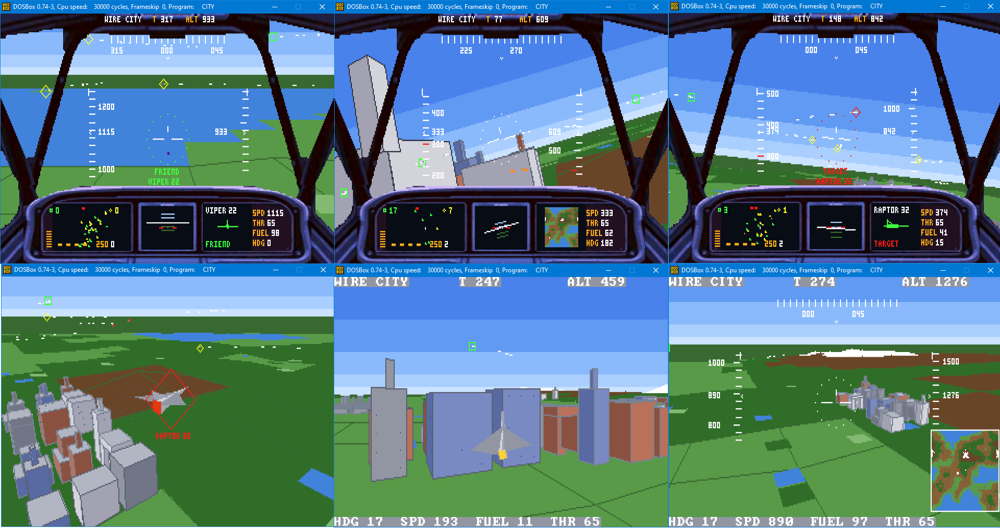

# OWL FLY
*Fly, owl!* — the flight simulator of the [WIRE CITY 86 arcade](../../README.md).

### ▶ Play online: https://kirindenis.github.io/wire-city-2/owlfly.html
### 💬 Community: [facebook.com/groups/OWLOS](https://www.facebook.com/groups/OWLOS) — dev stories, bug hunts (the LCG resonance, the flip-book islands, INT 0 under Turbo Debugger), new builds and retro-engineering talk

Built by the team behind **[Owlos](https://owlos.sk/)** — keeping and
modernizing legacy systems (MS-DOS, Turbo Pascal, Clipper, FoxPro, VB6,
Delphi) is our day job. We write *new* software for MS-DOS for fun;
imagine what we do for your business.



A polygon **combat flight sim in pure 8086 assembly** for DOS — VGA mode 13h,
integer math only, no libraries, no engine. The whole game is a **40 KB
`.COM`** plus a 63 KB resource file (the cockpit art and the font), built with
Turbo Assembler 3.2 in DOSBox. In the browser it runs on DOSBox compiled to
WebAssembly ([js-dos](https://js-dos.com)). **How the whole machine works:
[ARCHITECTURE.md](ARCHITECTURE.md)** — the memory discipline, the triple
painter's algorithm, the ring mixer, and the bugs the community caught.
Deep dives with the sources open live alongside the site: start with
[the 3D graphics](../../docs/GRAPHICS.md) (or its plain-language twin,
[3D for beginners](../../docs/GRAPHICS-101.md)) and
[the avionics](../../docs/AVIONICS-101.md); the transferable engineering
takeaways in [LESSONS](../../docs/LESSONS.md); teaching programs in
[EXAMPLES/](../../EXAMPLES/README.md).

Inside those kilobytes: a procedural island with a destructible city, a 20v20
attrition air war, homing missiles, a cannon with real tracer rounds, wrecks
that break into their own polygons and burn where they fall, six cameras
including a missile-ride view and a death flashback, an F-15-style HUD, and a
photo cockpit with a working radar.

## Controls

| Key | Action |
|---|---|
| **← / →** (num 4/6) | bank left / right — rolls through 360°, loops and barrel rolls work |
| **↓ / ↑** (num 2/8) | pull the nose up / push it down (flight-sim yoke) |
| **Z / C** (num 7/9) | rudder — flat turn without banking |
| **+ / −** or **W / S** | throttle up / down (some layouts eat + — W/S always work) |
| **A** | afterburner — double thrust, drinks fuel |
| **Enter** | lock the jet inside the aiming ring; Enter on empty sky drops the lock |
| **Backspace** | missile — 4 rails, homing on the lock, dumb-fire without one |
| **Space** (hold) | cannon — hits whatever sits inside the ring |
| **M** | right MFD: island map ↔ sensor view of the locked target |
| **V** | sound: all → effects only → silence (the S letter on the panel: amber / white / red) |
| **F2** | cockpit on / off |
| **F3** | chase camera (your own jet from behind) |
| **F4** | orbit camera around the locked target — arrows steer the orbit |
| **F5** | arm the missile camera: the next launch is ridden to impact |
| **N** | day / night (the stars are a real celestial sphere) |
| **Space** | after a crash: take a fresh jet |
| **ESC** | quit to DOS |

Hands off the stick — the plane rights itself and trims to level.

## The war

Two air forces over one island, split by a jagged red front line (south is
yours): each team fields **13 fighters, 3 four-engine bombers, a rotodome
radar picket, 2 transports and a tanker**, drawn up in battle formation
across the border. **VIPERS** (you fly green) against **BANDITS** (yellow). The dead stay dead; when a team is wiped
out, the winner banner lights up and two fresh squadrons take the sky. The
radar scoreboard shows the round's kills per team, your personal kills carry
across rounds.

- A jet soaks **2–5 cannon hits** or **one missile**; so do the buildings —
  a levelled block stays a ruin for the whole session, and falling wreckage
  can bring the neighbours down in a chain.
- Everything collides: jets with jets, jets with towers, wrecks with
  everything. Ramming works. Once.
- You take **5 hits** (red pips on the radar, the ring flashes). The fifth —
  or a hillside — plays your last five seconds back as a flashback, then the
  camera watches your jet come apart. GAME OVER, Space, again.
- Watch the tapes: the red line on the speed tape is the stall, the one on
  the altitude tape is the terrain right below you. The gunsight bar always
  stays level with the horizon; lose the horizon in a loop and a standby
  horizon appears at the ring.

## Repository layout

```
SRC/            all sources: CITY.ASM + the .INC modules (8086 / TASM)
ENGINE/         engine modules with documented contracts (shared with EXAMPLES)
EXAMPLES/       standalone teaching .COMs: island factory, ring mixer, hangar
INSTALL/        the playable build: CITY.COM + CITY.DAT
res/            cockpit artwork (BMP + PSD) and mkpanel.py (art -> resources)
docs/           the browser version (GitHub Pages serves this folder)
MAKE.BAT        full build from Windows: art converter + headless DOSBox
BUILD.BAT       assemble + link inside DOSBox (SRC -> INSTALL)
PUBLISH.BAT     repack docs/city.jsdos, bump the cache version, push
LICENSE         MIT (game code). The emulator (DOSBox / js-dos) is GPL.
```

## Build

**From Windows (recommended):** `MAKE.BAT` — runs `res\mkpanel.py` (Python +
Pillow; converts the cockpit BMPs into `SRC\PANELIMG.INC` / `SRC\PALPNL.INC`),
then assembles everything headlessly in DOSBox and installs
`INSTALL\CITY.COM` + `INSTALL\CITY.DAT`. Check `BUILD.LOG`.

**Inside DOSBox:** needs TASM + TLINK on the path (e.g. Borland at
`c:\bp\bin`), then `BUILD.BAT`. Note `TLINK /t` (lowercase t) produces a
**COM**, not an EXE. If it runs sluggishly, raise the emulator speed
(`cycles=max` or Ctrl+F12).

## Play in the browser

The same `CITY.COM` runs in DOSBox-WASM via js-dos. `PUBLISH.BAT` does the
whole deploy: packs `INSTALL\CITY.COM` + `INSTALL\CITY.DAT` + the DOSBox
config into `docs/city.jsdos` (zip with forward-slash entries!), bumps the
cache-busting `?v=` in `docs/index.html`, shows what will be committed, and
pushes. GitHub Pages serves `/docs`.

Local test (plain `file://` won't work):

```
python -m http.server -d docs 8080
```

**SharedArrayBuffer note:** GitHub Pages can't send COOP/COEP headers, so
`docs/coi-serviceworker.js` injects them client-side; the js-dos runtime is
self-hosted under `docs/jsdos/` (the CDN refuses cross-origin hotlinks).

## License

Game code (everything in `SRC/`, the scripts, the artwork pipeline): **MIT** —
see `LICENSE`. The browser build embeds **DOSBox** and **js-dos** (GPL) as the
runtime — tools that run the game, not part of its source.
