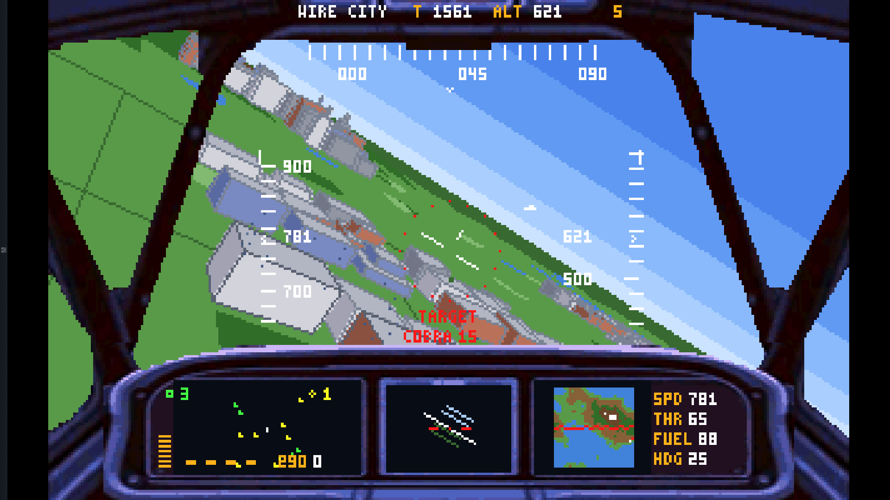
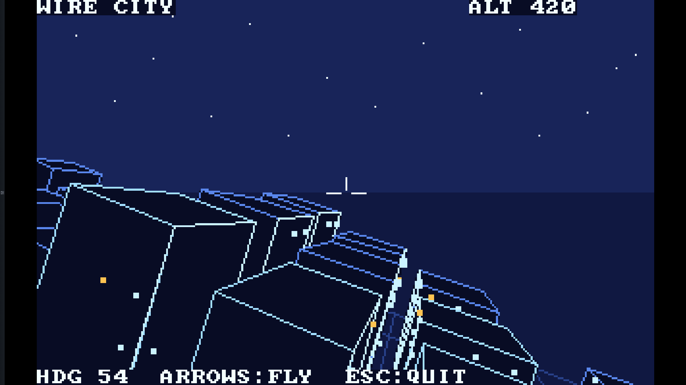

# WIRE CITY 86 — the DOS arcade

### ▶ Play: https://kirindenis.github.io/wire-city-2/
### 💬 Community: [facebook.com/groups/OWLOS](https://www.facebook.com/groups/OWLOS)

Real games in real **8086 assembly** (TASM 3.2, VGA mode 13h, integer math,
no libraries), running in the browser through DOSBox-WASM — and readable to
the last byte. Built by the team behind **[Owlos](https://owlos.sk/)**:
keeping legacy systems alive is our day job; writing new software for
MS-DOS is how we relax.

## The games

| Game | Size | What it is | |
|---|---|---|---|
|  **[OWL FLY](GAMES/OWLFLY/)** | 40 KB | The combat flight simulator: procedural island, destructible city, two air forces of five aircraft types, missiles, a photo cockpit with a working radar, a real jet engine in one Sound Blaster channel. *Fly, owl!* | [▶ play](https://kirindenis.github.io/wire-city-2/owlfly.html) |
|  **[WIRE CITY](GAMES/WIRECITY/)** | 5.5 KB | The 1986-style original that named the arcade: a wireframe night-flight over a procedural megacity, one source file. The ancestor. | [▶ play](https://kirindenis.github.io/wire-city-2/play.html?g=wirecity) |

## The teaching machines

Standalone `.COM`s a few KB each, built on the same [ENGINE/](ENGINE/)
modules the games use — see [EXAMPLES/](EXAMPLES/README.md):
[the hangar](https://kirindenis.github.io/wire-city-2/play.html?g=jet) ·
[the island factory](https://kirindenis.github.io/wire-city-2/play.html?g=terra) ·
[the avionics](https://kirindenis.github.io/wire-city-2/play.html?g=avio) ·
the ring mixer (build it) · the 1986 network chat (in the workshop).

## Reading

[ARCHITECTURE.md](GAMES/OWLFLY/ARCHITECTURE.md) — the 64K one-segment discipline and the
whole machine · [3D graphics](docs/GRAPHICS.md) (and
[the beginner version](docs/GRAPHICS-101.md)) ·
[avionics](docs/AVIONICS-101.md) · [LESSONS](docs/LESSONS.md) — what
40 kilobytes taught us · [llms.txt](llms.txt) for your AI assistant.

## Repository layout

```
GAMES/OWLFLY/     the flight simulator: SRC/, res/, INSTALL/, its README
GAMES/WIRECITY/   the 1986 original: one CITY.ASM, its README
ENGINE/           engine modules with documented contracts (shared by all)
EXAMPLES/         the teaching machines (each states its contract)
docs/             the arcade site: gallery, players, bundles, deep dives
MAKE.BAT          builds everything: converters + headless DOSBox + TASM
```

Build: `MAKE.BAT` from the repo root (needs Python+Pillow and paths in a
gitignored `LOCAL.BAT`; see [GAMES/OWLFLY/README.md](GAMES/OWLFLY/README.md)
for details). The site deploys from `docs/` via GitHub Pages;
`PUBLISH.BAT` packs a fresh game bundle (filename-versioned — js-dos caches
by path).

## What is in the workshop

Multiplayer over IPX tunneled through WebSocket (the 1986 chat already
talks between two DOSBoxes), a C# gateway with a tournament page and a
NOW-PLAYING API, and — one day — the emulator streamed to an ESP32 screen.

## License

Game code MIT (see LICENSE). DOSBox / js-dos (GPL) are the runtime that
plays the games, not part of their source.
