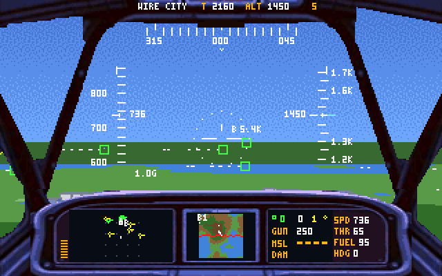
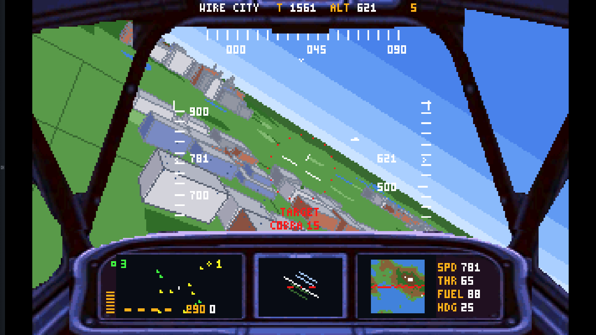
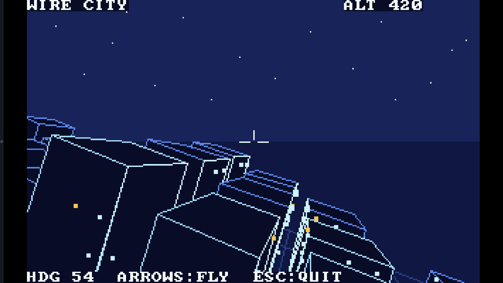

# WIRE CITY 86 — the DOS arcade

### ▶ Play: https://kirindenis.github.io/wire-city-2/
### 💬 Community: [facebook.com/groups/OWLOS](https://www.facebook.com/groups/OWLOS)

Real games in real **8086 assembly** (VGA mode 13h, integer maths, no
libraries), running in the browser through DOSBox-WASM — and readable to the
last byte. The assembler ships with them, so you can rebuild any of it
yourself without buying or installing a thing. Built by the team behind **[Owlos](https://owlos.sk/)**:
keeping legacy systems alive is our day job; writing new software for
MS-DOS is how we relax.

## Why this exists

**Then.** A DOS game fit in five kilobytes because it had to. The machine
offered one stretch of memory worth caring about, no libraries, no framework
— and the programmer knew the price of every byte and every instruction,
because the bill arrived instantly: the program either fit and ran at full
speed, or it did not exist. Software was written *against* the machine, with
the whole machine held in one head.

**Now.** That way of working is being forgotten. The people who wrote like
this are retiring, while the systems they built still run banks, factories
and railways — and the skill to look after them is leaving the industry
faster than the systems are. This is **[Owlos](https://owlos.sk/)**'s day
job: we know how these systems were written, and we modernise them so they
can be supported for the years ahead — and when the job calls for it, we
can still write the way they were written.

**So.** This repository is the proof, kept in public:

- **Part lineage.** The smallest one ships beside its successors, and they
  are meant to be played in order — a wireframe night-flight, then a flight
  simulator, then a multiplayer air war. One idea growing up inside the same
  constraints, on the same 8086, every byte still readable.
- **Part working method.** When the job calls for writing the old way, we
  still can — and these games are the demonstration, built exactly as it
  was done then: arithmetic you can prove on paper, memory budgets you read
  as a number before you build, the hardware itself used as the library it
  always was. And where the old meets today's tools, today serves
  yesterday — modern converters prepare the art and the sounds, but the
  8086 is the runtime, never the toolchain.
- **Part lesson.** Every routine in ~30,000 lines of assembly carries its
  reasoning, not just its mechanics — what this is for, why the constant,
  what broke the last time someone touched it. The code teaches the way it
  was taught: by being read.

What the method buys — then and now — is the advantage of this repository:
nothing hidden behind a framework, the cost of everything visible, and
programs small enough that one person can hold the whole machine in their
head. That is not nostalgia. It is an engineering standard, and this is
what it looks like applied.

## The games

| Game | What it is | |
|---|---|---|
|  **[OWL FLY II](GAMES/OWLFLY2/)** | **The multiplayer successor**, 105 KB of code and 162 KB of data: one shared sky over IPX-through-WebSocket, and no menu — you arrive as a spectator over the bot war, an orbit camera on whoever has a missile on his tail, and **Enter takes a jet**, stopped on your own runway with the brakes set. An F-15 SE II cockpit with NATO-shape radar symbology, three MFD pages (MAP / SIT / TGT), a ground school (rotation speed, wheel brakes, nose-wheel steering), a recorded sound bank mixed through one DMA ring, and an afterburner worth four dry engines. The data is the painted cockpit (63 KB front, 47 KB side views) and the sounds (52 KB). | [▶ play](https://kirindenis.github.io/wire-city-2/owlfly2.html) |
|  **[OWL FLY](GAMES/OWLFLY/)** | The combat flight simulator, 40 KB: procedural island, destructible city, two air forces of five aircraft types, missiles, a photo cockpit with a working radar, a real jet engine in one Sound Blaster channel. *Fly, owl!* | [▶ play](https://kirindenis.github.io/wire-city-2/owlfly.html) |
|  **[WIRE CITY](GAMES/WIRECITY/)** | The one that named the arcade, 5.5 KB in a single source file: a wireframe night-flight over a procedural megacity. Where the rest of it started. | [▶ play](https://kirindenis.github.io/wire-city-2/play.html?g=wirecity) |

## The teaching machines

Thirteen standalone `.COM`s, a few KB each, built on the same
[ENGINE/](ENGINE/) modules the games use — each demonstrates one technique on
the real engine code rather than on a copy of it. See
[EXAMPLES/](EXAMPLES/README.md):
[the hangar](https://kirindenis.github.io/wire-city-2/play.html?g=jet) ·
[the island factory](https://kirindenis.github.io/wire-city-2/play.html?g=terra) ·
[the avionics](https://kirindenis.github.io/wire-city-2/play.html?g=avio) ·
the ring mixer · the take-off, the approach and the touchdown as three
separate programs · a particle trail · a network chat over IPX.

They all build from their own folder with nothing but this repository:

```
cd EXAMPLES
MAKE            all thirteen
MAKE JET        just that one
RUN JET
```

## Reading

[ARCHITECTURE.md](GAMES/OWLFLY/ARCHITECTURE.md) — the 64K one-segment discipline and the
whole machine · [3D graphics](docs/GRAPHICS.md) (and
[the beginner version](docs/GRAPHICS-101.md)) ·
[avionics](docs/AVIONICS-101.md) · [LESSONS](docs/LESSONS.md) — what
40 kilobytes taught us · [llms.txt](llms.txt) for your AI assistant.

## Repository layout

```
GAMES/OWLFLY2/    OWL FLY II, the multiplayer successor (EXE, far segments)
GAMES/OWLFLY/     the flight simulator: SRC/, res/, INSTALL/, its README
GAMES/WIRECITY/   the wireframe night-flight: one CITY.ASM, its README
ENGINE/           engine modules with documented contracts (shared by all)
EXAMPLES/         the thirteen teaching machines (each states its contract)
LAB/              the workbench: one city block that holds still, and a
                  camera to walk round it (HOUSE.COM) - not shipped
docs/             the arcade site: gallery, players, bundles, deep dives
TOOLS/            the assembler, the DPMI host and the converters
                  - see THIRD-PARTY.md for what is whose
TASM/             the Turbo Assembler originals of everything that has
                  finished migrating, with the binaries they produced
GO.BAT            start here, inside DOS. The only batch file in the root,
                  and it builds nothing - each program builds itself
```

Everything that serves one program lives in that program's folder — its
source, its `MAKE`, its `RUN`, its README. A root full of per-game batch
files is the mess this layout exists to avoid.

**Building it, in DOS.** Mount this folder in DOSBox and type `GO`. It tells
you the rest: each program is built and run from its own directory, with
`MAKE` and `RUN`. Nothing has to be bought, downloaded or installed. The
assembler is [flat assembler](https://flatassembler.net/) in `TOOLS/FASM`,
free to use and to pass on; `MAKE` also loads the small DPMI host in
`TOOLS/CWSDPMI`, because FASM is a 32-bit program and DOS is not.

**Building it, from Windows.** Every folder has a `MAKEWIN` and a `RUNWIN`
that open DOSBox for you and close it again. They are not a second build —
they drive the same `MAKE.BAT` the DOS route uses, so there is only ever one
way anything here is assembled. Machine paths go in a gitignored `LOCAL.BAT`
(`set DOSBOX=...`).

The site deploys from `docs/` via GitHub Pages; `PUBLISH.BAT` packs a fresh
game bundle (filename-versioned — js-dos caches by path).

## Off Turbo Assembler, all of it

This was written with Borland's **Turbo Assembler**, which is commercial
software: it cannot be shipped, so it cannot be handed to you, so the sources
were not really yours to build. **Every program has now moved to FASM** — the
three games, the trainer, the force-model aeroplane, the lab, the model
precompiler and all thirteen teaching machines. The assembler that builds
them is in this repository and free to pass on.

The originals are frozen in [`TASM/`](TASM/) with the binaries they produced,
and those binaries are the point: a translation between assemblers cannot be
checked with a checksum, because the two builds are not meant to match. TASM
is one-pass, so it reserves room for a long jump and pads what it could not
take back with `NOP`. The standard here is **complete accounting** — every
byte of the difference named. [`TOOLS/BinAccount`](TOOLS/BinAccount) decodes
both builds instruction by instruction and stops at anything it cannot
explain.

```bash
dotnet run --project TOOLS\BinAccount -c Release -- TASM\EXAMPLES\JET.COM EXAMPLES\JET.COM
```

All twenty programs pass. OWL FLY II, the one real EXE, is checked segment by
segment — its five windows sit end to end and the game counts paragraphs past
them, so the boundaries are read from the executable's own relocation table
and each is accounted for on its own.

That is not ceremony. It caught ten **386 instructions** in a WIRE CITY build
that looked finished: TASM's `.8086` restricts the instruction set, FASM has
no equivalent directive, and the restriction was silently lost in
translation. The build ran perfectly on every emulator and would have died on
the machine the code is written for.
[`ENGINE/E_8086.INC`](ENGINE/E_8086.INC) puts it back — and the same file
now carries `LOOP` and `JCXZ`, which reach 127 bytes and have no long form on
any processor at all.

## What is in the workshop

Multiplayer over IPX tunneled through WebSocket is **live in OWL FLY II**
(browser pilots meet through the relay; native DOSBoxes over `ipxnet`).
Still cooking: in-game chat riding the same wire, real callsigns, relay
bots keeping the skies alive, a NOW-PLAYING API — and, one day, the
emulator streamed to an ESP32 screen.

## License

Game code MIT (see LICENSE). DOSBox / js-dos (GPL) are the runtime that
plays the games, not part of their source.
